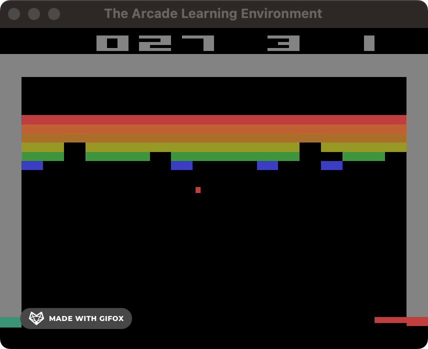
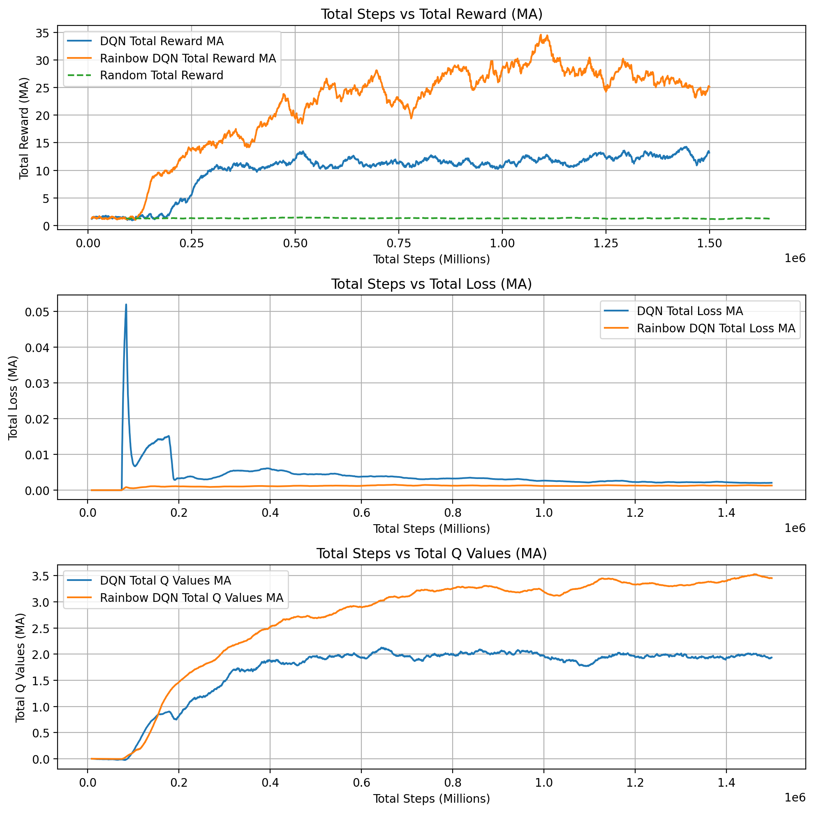

# Deep Q-Network (DQN) Implementation and Upgrades

## Introduction

> Please take a look to the [**report.pdf**](report.pdf) in the repository for more detailed information about the project, such as hyperparameters and more.

This project re-implements and enhances the Deep Q-Network (DQN) originally introduced by Mnih et al. (2015). We replicated the DQN with modifications to accommodate computational constraints and integrated components from the Rainbow algorithm by Hessel et al. (2017) including dueling networks, prioritized experience replay, n-step returns, and noisy networks.

Due to limited computational resources, we were unable to train the models long enough to reach the highest scores reported in the original paper. However, evaluations against a random action baseline showed significant performance improvements, and the learning curves indicate that with extended training, especially for the Rainbow-enhanced DQN, the models would continue to improve. This demonstrates the effectiveness of the enhancements and the potential for further development.

## Motivation

Our goal was to deepen our understanding of reinforcement learning and deep learning by reimplementing the DQN and integrating Rainbow components. This hands-on approach allowed us to explore foundational mechanics and evaluate the impact of advanced RL techniques, satisfying our curiosity and contributing to our educational growth.

### Environment

- **Game**: Atari 2600 Breakout
- **Goal**: Achieve the highest score by breaking bricks with a ball using a paddle. The agent receives a reward for each brick broken and aims to maximize the total reward.
- **Typical Human Strategy**: Focus on breaking through the sides to reach the top of the brick wall.
- **Reason of Choice**: Manageable complexity and availability of comparative metrics.

### Baseline Comparison

To ensure that improvements are meaningful and not due to environmental dynamics, we compared the agent's performance to a *random action baseline*.

## Upgrades Using Rainbow Components

We enhanced the original DQN implementation by integrating several components from the Rainbow algorithm:

1. **Double DQN**: Addresses overestimation bias by decoupling action selection and evaluation.
2. **Dueling Network Architecture**: Separates the estimation of state value and advantage for each action.
3. **Prioritized Experience Replay**: Samples important transitions more frequently based on temporal-difference (TD) error.
4. **N-Step Returns**: Uses multi-step returns for better learning from delayed rewards.
5. **Noisy Networks**: Adds stochasticity to network weights to improve exploration.

## Results

### Performance Metrics

#### Training

#### Testing
| **Experiment**         | **Average Reward** | **Standard Deviation** | **Max Reward** | **Min Reward** |
|------------------------|--------------------|------------------------|----------------|----------------|
| Original DQN           | 5.40      | 3.24          | 11.0  | 0.0  |
| Rainbow-enhanced DQN   | 22.24      | 8.55          | 46.0  | 8.0  |
| Random Baseline        | 1.40      | 1.15          | 5.0  | 0.0  |

The enhanced DQN showed improved performance over the classic DQN and significantly outperformed the random action baseline. Although we could not train the models long enough to achieve the highest scores due to computational limitations, the learning curves indicate that with longer training, the models would continue to improve, potentially reaching higher performance levels.

The results demonstrate the effectiveness of integrating advanced components from the Rainbow algorithm and suggest that extended training would allow the agent to develop more sophisticated strategies, such as focusing on breaking through the sides to reach the top of the brick wall in Breakout.

## Repository Structure

- [`/notebooks/`](notebooks/): Jupyter notebooks containing the code for each version of the implementation.
- [`/checkpoints/`](checkpoints/): Saved model checkpoints at different timesteps during training.
- [`/data/`](data/): Plot data and logs generated during training.
- [`/notebooks/utils/`](notebooks/utils/): Utility functions for plotting.
- [`/imgs/`](imgs/): Images used in the README and report.
- [`/report.pdf`](report.pdf): The full report detailing the implementation and results.

## References

- [1] Mnih, V., Kavukcuoglu, K., Silver, D. et al. (2015). *Human-level control through deep reinforcement learning*. Nature, 518, 529–533. [https://doi.org/10.1038/nature14236](https://doi.org/10.1038/nature14236)
- [2] Hessel, M., et al. (2017). *Rainbow: Combining Improvements in Deep Reinforcement Learning*. arXiv preprint arXiv:1710.02298. [https://arxiv.org/abs/1710.02298](https://arxiv.org/abs/1710.02298)

## Acknowledgments

We would like to thank the authors of the original papers for their foundational work in reinforcement learning and deep learning.